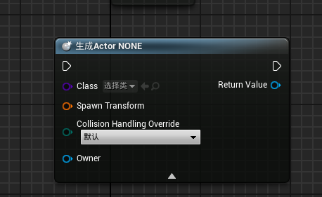
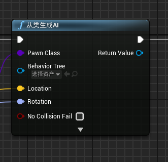
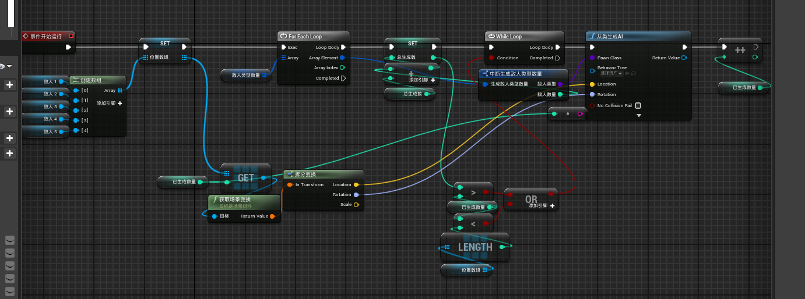

# 第三节：人物攻击动画，人物被攻击动画，敌人生成机制

##### **蓝图接口**
    蓝图接口: 可以通过一个类调用另一个类的事件也就是可以起到桥梁的作用
        1.添加接口后新建函数，添加输入输出
        2.在需要应用接口的类设置->接口里选择创建的接口
        3.编辑接口
    动画蓝图的通信
        1.动画蓝图的通信需要通过动画蓝图的父类如玩家通过  获取动画蓝图实例  节点 –>  类型转换为具体的动画蓝图  来获取到蓝图的实例，以调用动画蓝图的事件

##### **生成actor节点**
        Spwn AiFrom Class(从类生成Actor)
            生成给定类的AI代理
        生成Actor NONE
            尝试是使用指定的变化生成ACtor

